# Introduction

*MeDeCom* is an R-package for reference-free decomposition of heterogeneous DNA methylation profiles. 
It uses matrix factorization enhanced by constraints and a specially tailored regularization. 
*MeDeCom* represents an input $m\times n$ data matrix ($m$ CpGs measured in $n$ samples) as a product of two other matrices. 
The first matrix has $m$ rows, just as the input data, but the number of columns is equal to $k$. 
The columns of this matrix can be interpreted as methylomes of the $k$ unknown 
cell populations underlying the samples and will be referred to as **latent methylation components** or **LMCs**. 
The second matrix has $k$ rows and $n$ columns, and can be interpreted as a matrix of relative contributions (mixing proportions) 
of each LMC to each sample.

*MeDeCom* starts with a set of related DNA methylation profiles, e.g. a series of Infinium microarray measurements
from a population cohort, or several bisulfite sequencing-based methylomes. The key requirement is that
 the input data represents absolute DNA methylation measurements in a population of cells 
and contains values between 0 and 1. *MeDeCom* implements an alternating scheme which iteratively 
updates randomly initialized factor matrices until convergence or until the maximum number of iterations 
has been reached. This is repeated for multiple random initializations and the best solution is returned.

MeDeCom features two tunable parameters. The first one is the number of LMCs $k$, an approximate choice for which 
should be known from prior information. To enforce the distribution properties of a methylation profile 
upon LMCs *MeDeCom* uses a special for of regularization controlled by the parameter $\lambda$. 
A typical *MeDeCom* experiment includes testing a grid of values for $k$ and $\lambda$. For each combination 
of parameter values *MeDeCom* estimates a cross-validation error. The latter helps select the optimal number 
of LMCs and the strength of regularization.

# Installation

*MeDeCom* can be installed directly from github using the package `devtools`:


```r
devtools:::install_github("lutsik/MeDeCom")
```

Currently only *nix-like platforms with a C++11-compatible compiler are supported.
MeDeCom uses stack model for memory to accelerate factorization for smaller ranks. 
This requires certain preparation during compilation, therefore, please, note the extended
compilation time (15 to 20 minutes).

# Data preparation

*MeDeCom* accepts DNA methylation data in several forms. Preferably the user may load and preprocess the data
using a general-purpose DNA methylation analysis package [RnBeads](http://rnbeads.mpi-inf.mpg.de). A resulting RnBSet object
can be directly supplied to *MeDeCom*. Alternatively, *MeDeCom* runs on any matrix of type `numeric` with valid methylation values.

*MeDeCom* comes with a small example data set obtained by mixing reference profiles of blood cell methylomes *in silico*.
The example data set can be loaded in a usual way:


```r
## load the package
library(MeDeCom)
```

```r
##  load the example data sets
data(example.dataset, package="MeDeCom")
## you should get objects D, Tref and Aref
## in your global R environment
ls()
```

```
## [1] "Aref" "D"    "Tref"
```

Loaded numeric matrix `D` contains 100 *in silico* mixtures and serves as an example input. Columns of matrix `Tref` contains the methylomes 
of 5 blood cell types used to generate the mixtures, while matrix `Aref` provides the mixing proportions.

```r
## matrix D has dimension 10000x100
str(D)
```

```
##  num [1:10000, 1:100] 0.0354 0.0491 0.3411 0.873 0.1781 ...
```

```r
## matrix Tref has dimension 10000x5
str(Tref)
```

```
##  num [1:10000, 1:5] 0.1 0.0847 0.3167 0.834 0.0455 ...
##  - attr(*, "dimnames")=List of 2
##   ..$ : NULL
##   ..$ : chr [1:5] "Neutrophils" "CD4+ T-cells" "CD14+ Monocytes" "CD8+ T-cells" ...
```

```r
## matrix Aref has dimension 5x100
str(Aref)
```

```
##  num [1:5, 1:100] 6.54e-01 3.80e-02 3.06e-01 1.56e-13 2.45e-03 ...
```
# Performing a methylome decomposition experiment

*MeDeCom* can be run directly on matrix `D`. 

It is crucial to select the values of parameters $k$ and $\lambda$ to test. 
A choice of $k$ is often dictated by prior knowledge about the methylomes.
Precise value of lambda has to be selected for each data set independently. A good start 
is a logarithmic grid of lambda values. It is important to include $\lambda=0$ into the 
grid, as this particular case the regularization is effectively absent making *MeDeCom* similar 
to other NMF-based deconvolution algorithms.

```
medecom.result<-runMeDeCom(D, Ks=2:10, lambdas=c(0,10^(-5:-1)))
```

*MeDeCom* is based upon an alternating optimization heuristic and requires a lot 
of computation. The processing of the data matrix can take several hours.
One can speed up the run by decreasing the number of cross-validation folds and random initializations, and 
increasing the number of computational cores.


```r
medecom.result<-runMeDeCom(D, 2:10, c(0,10^(-5:-1)), NINIT=10, NFOLDS=10, ITERMAX=300, NCORES=9)
```


```
## 
## [Main:] checking inputs
## [Main:] preparing data
## [Main:] preparing jobs
## [Main:] 3114 factorization runs in total
## [Main:] runs 2755 to 2788 complete
## [Main:] runs 2789 to 2822 complete
## [Main:] runs 2823 to 2856 complete
## [Main:] runs 2857 to 2890 complete
## ......
## [Main:] finished all jobs. Creating the object
```

This can, however, lead to decomposition slightly different from the one presented given below.

The results of a decomposition experiment are saved to an object of class `MeDeComSet`.
The contents of an object can be conveniently displayed using the `print` functionality.


```r
medecom.result
```

```
## An object of class MeDeComSet
## Input data set:
## 	10000 CpGs
## 	100 methylomes
## Experimental parameters:
## 	k values: 2, 3, 4, 5, 6, 7, 8, 9, 10
## 	lambda values: 0, 1e-05, 1e-04, 0.001, 0.01, 0.1
```

# Exploring the decomposition results

## Parameter selection 

The first key step is parameter selection. It is important to carefully explore the obtained results and make a decision about 
the most feasible parameter values, or about extending the parameter value grids to be tested in refinement experiments.

*MeDeCom* provides a **cross-validation error** (CVE) for each tested parameter combination.


```r
plotParameters(medecom.result)
```

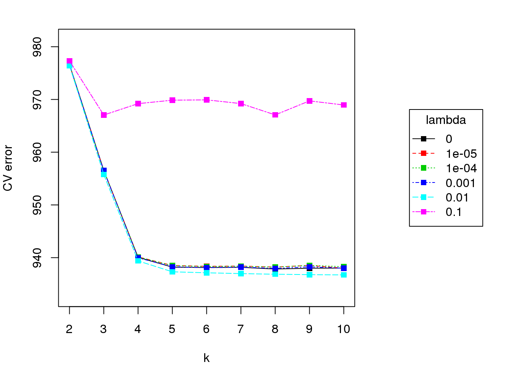

A lineplot helping to select parameter $\lambda$ can be produced by specifying a fixed value for $k$:


```r
plotParameters(medecom.result, K=5, lambdaScale="log")
```

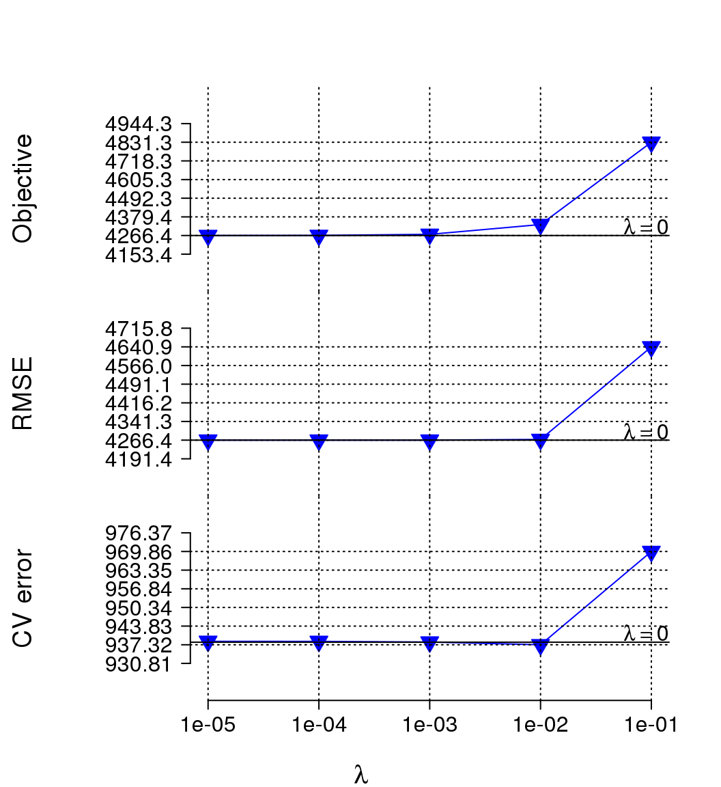

Cross-validation error has a minimum at $\lambda=10^{-2}$ so this value is preferred.

## Latent methylation components (LMCs)

A matrix of LMCs can be extracted using `getLMCs`:


```r
lmcs<-getLMCs(medecom.result, K=5, lambda=0.01)
str(lmcs)
```

```
##  num [1:10000, 1:5] 0 0.0184 0.2898 0.7856 0 ...
```

LMCs can be seen as measured methylation profiles of purified cell populations. 
*MeDeCom* provides for several visualization methods for LMCs using the function `plotLMCs` 
which operates directly on `MeDeComSet` objects.

### Clustering

For instance, standard hierarchical clustering can be visualized using:

```r
plotLMCs(medecom.result, K=5, lambda=0.01, type="dendrogram")
```

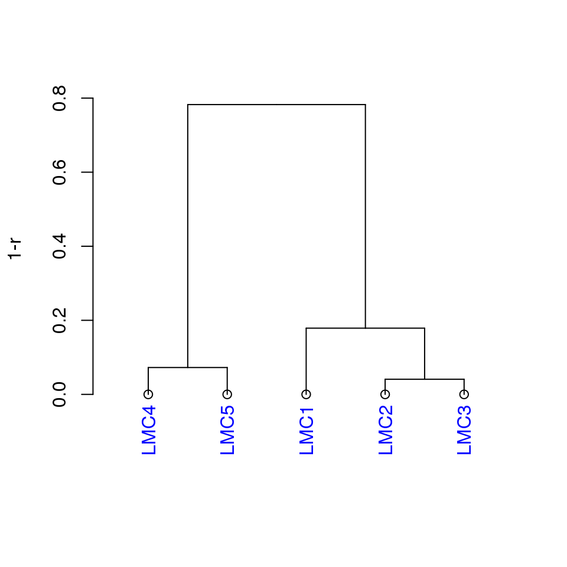

A two-dimensional embedding with MDS is also obtainable:


```r
plotLMCs(medecom.result, K=5, lambda=0.01, type="MDS")
```

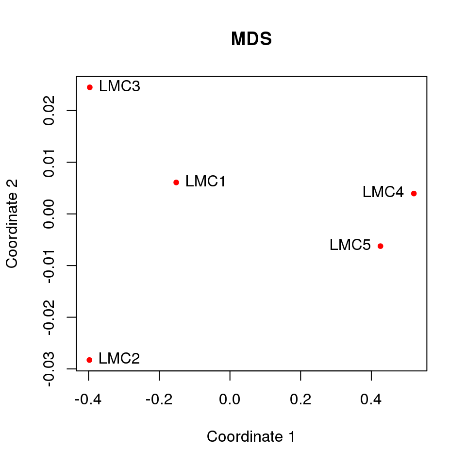

Input data can be included into the MDS plot to enhance the interpretation.


```r
plotLMCs(medecom.result, K=5, lambda=0.01, type="MDS", D=D)
```

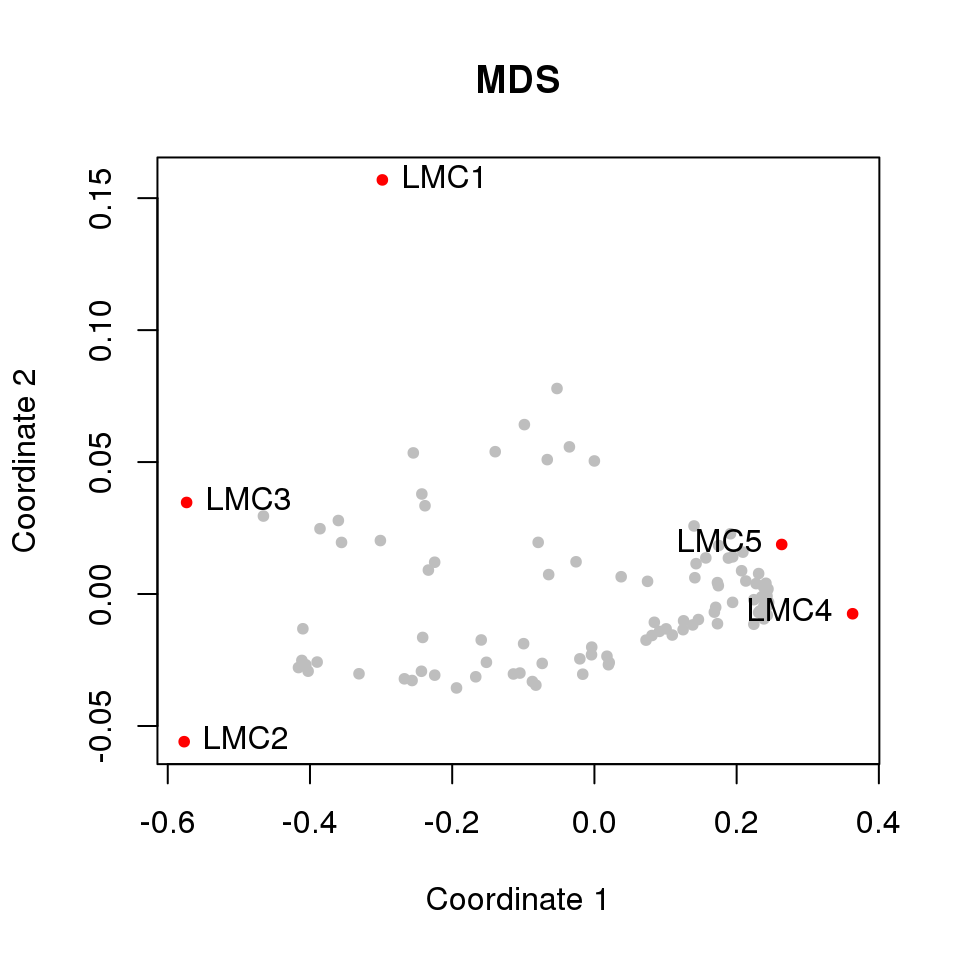

### Matching LMCs to reference profiles

In many cases reference methylomes exists, which are relevant for the data set in question.
For our example analysis matrix `Tref` contains the reference type 
profiles which were *in silico* mixed. *MeDeCom* offers several ways to visualize the 
resulting LMCs together with the reference methylation profiles. The reference methylomes 
can be included into a joint clustering analysis: 


```r
plotLMCs(medecom.result, K=5, lambda=0.01, type="dendrogram", Tref=Tref, center=TRUE)
```

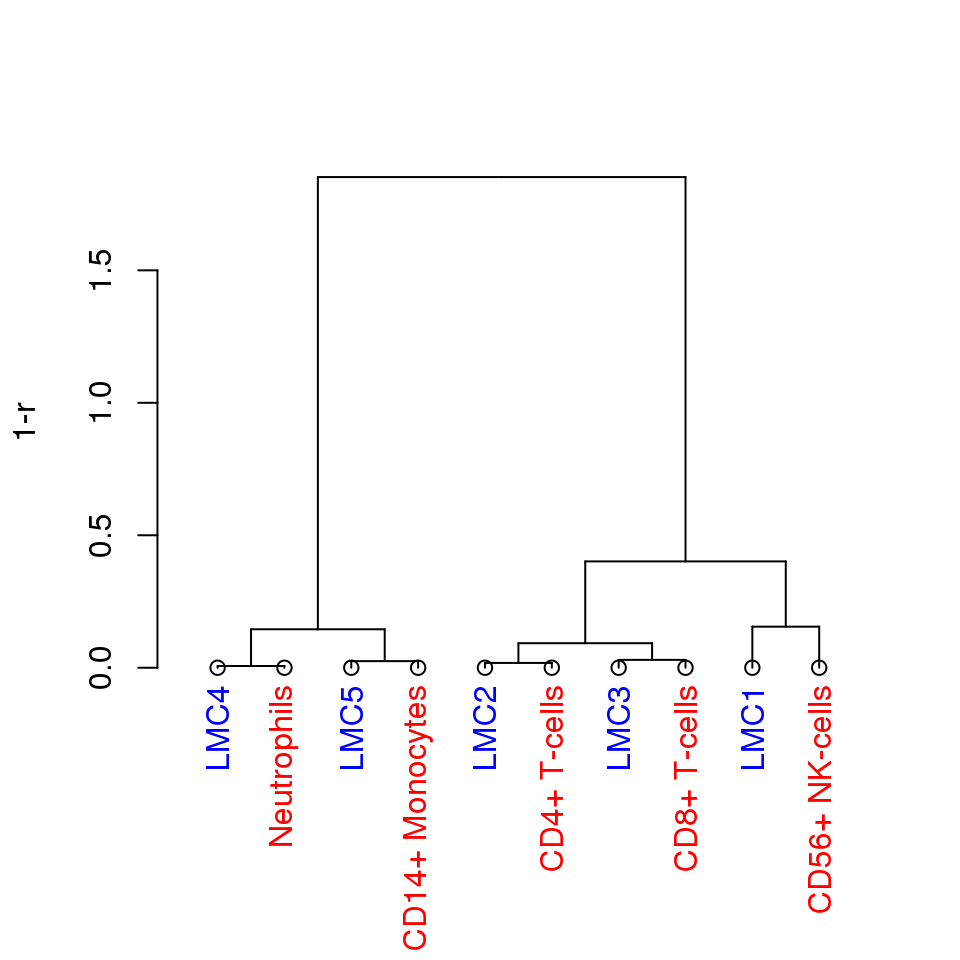

Furthermore, a similarity matrix of LMCs vs reference profiles can be visualized as a heatmap.


```r
plotLMCs(medecom.result, K=5, lambda=0.01, type="heatmap", Tref=Tref)
```

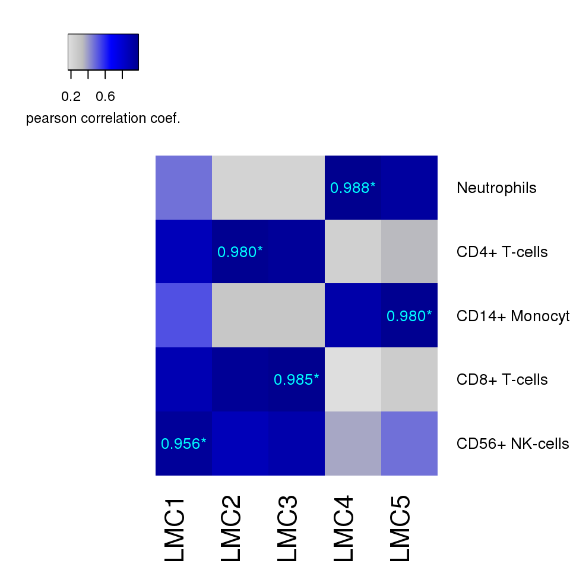

Correlation coefficient values and asterisks aid the interpretation.
The values are displayed in the cells which contain maximal values column-wise.
The asterisks mark cells which have the highest correlation value in the respective rows.
Thus, a value with asterisk corresponds to a mutual match, i.e. LMC unambiguously 
matching a reference profile.

In this example analysis each LMC uniquely matches one of the reference 
profiles. The matching of 

Function `matchLMCs` offers several methods for 
matching LMCs to reference profiles.


```r
perm<-matchLMCs(lmcs, Tref)
```

## Mixing proportions

A matrix of mixing proportions is obtained using `getProportions`:


```r
prop<-getProportions(medecom.result, K=5, lambda=0.001)
str(prop)
```

```
##  num [1:5, 1:100] 0.3411 0 0.065 0.0213 0.5726 ...
##  - attr(*, "dimnames")=List of 2
##   ..$ : chr [1:5] "LMC1" "LMC2" "LMC3" "LMC4" ...
##   ..$ : NULL
```

### Visualization of the complete proportion matrix

A complete matrix of propotions can be visualized as a stacked barplot:

```r
plotProportions(medecom.result, K=5, lambda=0.01, type="barplot")
```

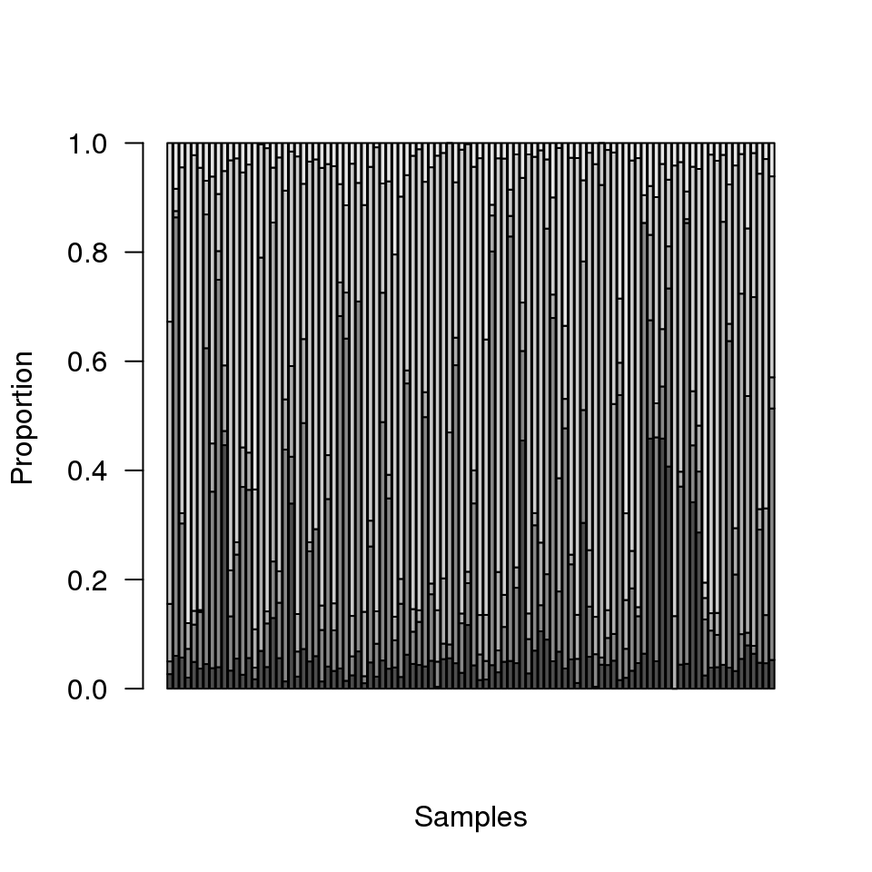

or a heatmap:


```r
plotProportions(medecom.result, K=5, lambda=0.01, type="heatmap")
```

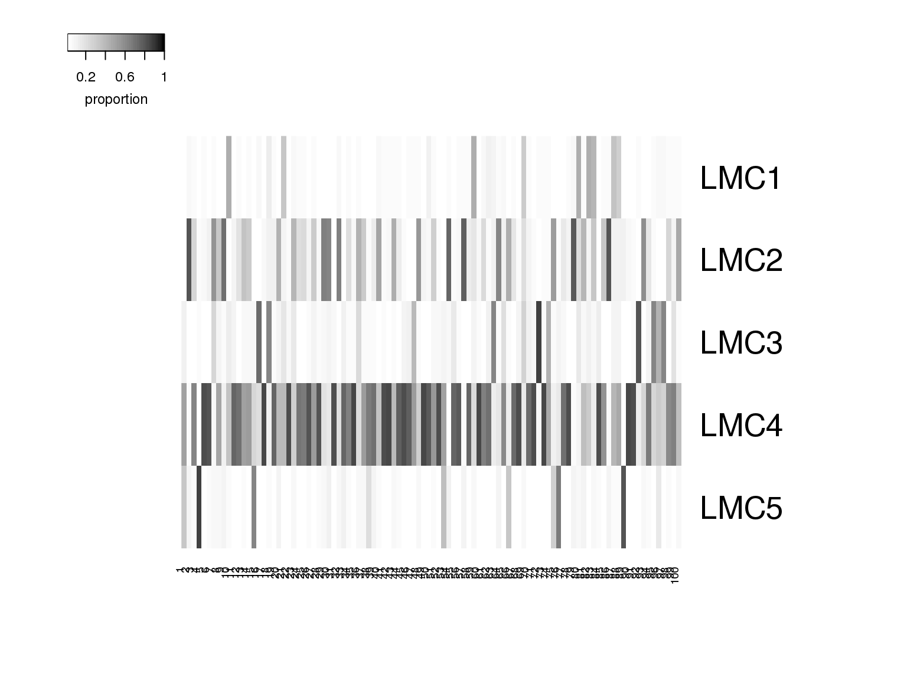

The heatmap can be enhanced by clustering the columns:


```r
plotProportions(medecom.result, K=5, lambda=0.01, type="heatmap", heatmap.clusterCols=TRUE)
```

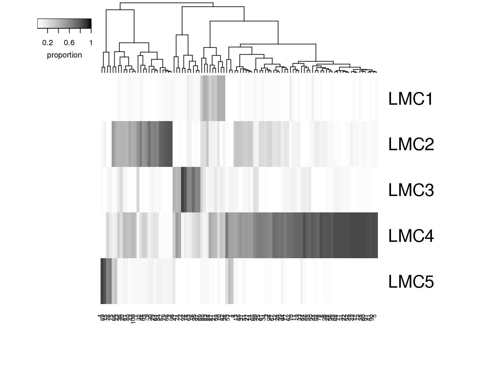

or adding color code for the samples:


```r
sample.group<-c("Case", "Control")[1+sample.int(ncol(D))%%2]
plotProportions(medecom.result, K=5, lambda=0.01, type="heatmap", sample.characteristic=sample.group)
```

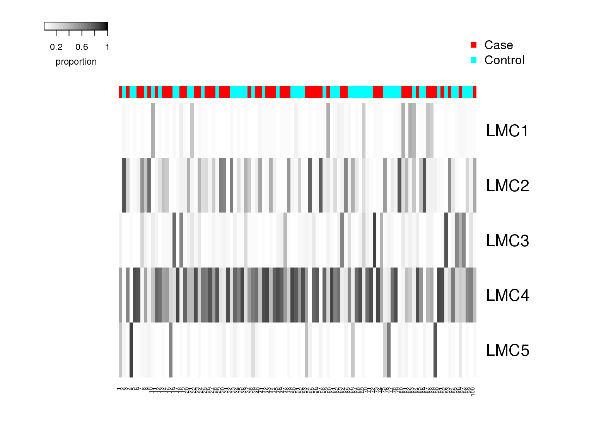

### Visualization of selected LMC proportions


```r
plotProportions(medecom.result,  K=5, lambda=0.01, type="lineplot", lmc=2, Aref=Aref, ref.profile=2)
```

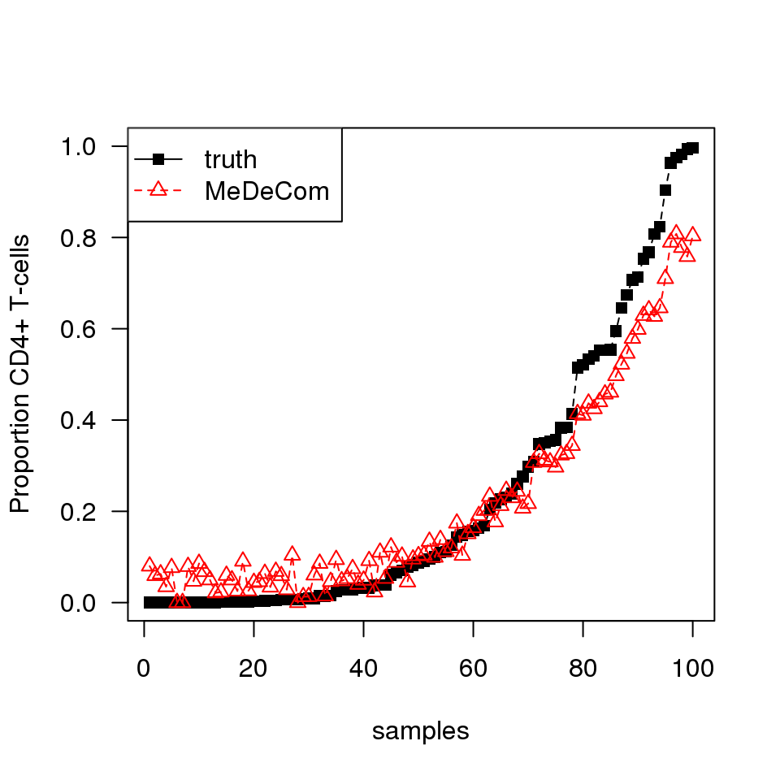

# Advanced usage

## Running *MeDeCom* on a compute cluster

*MeDeCom* experiments require a lot of computational time. On the other hand most of the factorization runs are 
independent and, therefore, can be run in parallel. Thus, a significant speedup can be achieved when running *MeDeCom* 
in an HPC environment. *MeDeCom* can be easily adapted to most of the popular schedulers. There are, however, several prerequisites:

 * the scheduler provides the standard utilities `qsub` for the submission of the cluster jobs and `qstat` for obtaining the job statistics;
 * the cluster does not have a low limit on the number of submitted jobs;
 * the R installation (location of the R binary and the package library) is consistent across the execution nodes.

The example below 
is for the cluster operated by *Son of Grid Engine* (SoGE). To be able to run on a SoGE cluster *MeDeCom* needs to know:

 * location of the R executable (directory);
 * an operating memory limit per each factorization job;
 * a pattern for the names of cluster nodes to run the jobs on.

These settings should be stored in a `list` object:

```r
sge.setup<-list(
R_bin_dir="/usr/bin",
host_pattern="*",
mem_limit="5G"
)
```
This object should be supplied to *MeDeCom* as the argument `cluster.settings`. It is also important to specify a valid temporary 
directory, which is available to all execution nodes.

```r
medecom.result<-runMeDeCom(D, Ks=2:10, lambdas=c(0,10^(-5:-1)), N_COMP_LAMBDA=1, NFOLDS=5, NINIT=10, 
temp.dir="/cluster_fs/medecom_temp",
cluster.settings=sge.setup)
```
*MeDeCom* will start the jobs and will periodically monitor the number of remaining ones.

```
## 
## [Main:] checking inputs
## [Main:] preparing data
## [Main:] preparing jobs
## [Main:] 3114 factorization runs in total
## [Main:] 3114 jobs remaining
## ....
## [Main:] finished all jobs. Creating the object
```

# R session
Here is the output of `sessionInfo()` on the system on which this document was compiled:

```
## R version 3.5.1 (2018-07-02)
## Platform: x86_64-pc-linux-gnu (64-bit)
## Running under: Debian GNU/Linux 8 (jessie)
## 
## Matrix products: default
## BLAS: /usr/lib/atlas-base/atlas/libblas.so.3.0
## LAPACK: /usr/lib/atlas-base/atlas/liblapack.so.3.0
## 
## locale:
##  [1] LC_CTYPE=en_US.UTF-8       LC_NUMERIC=C              
##  [3] LC_TIME=en_US.UTF-8        LC_COLLATE=en_US.UTF-8    
##  [5] LC_MONETARY=en_US.UTF-8    LC_MESSAGES=en_US.UTF-8   
##  [7] LC_PAPER=en_US.UTF-8       LC_NAME=C                 
##  [9] LC_ADDRESS=C               LC_TELEPHONE=C            
## [11] LC_MEASUREMENT=en_US.UTF-8 LC_IDENTIFICATION=C       
## 
## attached base packages:
##  [1] grid      stats4    parallel  stats     graphics  grDevices utils    
##  [8] datasets  methods   base     
## 
## other attached packages:
##  [1] MeDeCom_0.2.1                          
##  [2] RnBeads_2.0.0                          
##  [3] plyr_1.8.4                             
##  [4] methylumi_2.28.0                       
##  [5] minfi_1.28.0                           
##  [6] bumphunter_1.24.5                      
##  [7] locfit_1.5-9.1                         
##  [8] iterators_1.0.10                       
##  [9] foreach_1.4.4                          
## [10] Biostrings_2.50.1                      
## [11] XVector_0.22.0                         
## [12] SummarizedExperiment_1.12.0            
## [13] DelayedArray_0.8.0                     
## [14] BiocParallel_1.16.2                    
## [15] FDb.InfiniumMethylation.hg19_2.2.0     
## [16] org.Hs.eg.db_3.7.0                     
## [17] TxDb.Hsapiens.UCSC.hg19.knownGene_3.2.2
## [18] GenomicFeatures_1.34.1                 
## [19] AnnotationDbi_1.44.0                   
## [20] reshape2_1.4.3                         
## [21] scales_1.0.0                           
## [22] Biobase_2.42.0                         
## [23] illuminaio_0.24.0                      
## [24] matrixStats_0.54.0                     
## [25] limma_3.38.2                           
## [26] gridExtra_2.3                          
## [27] ggplot2_3.1.0                          
## [28] fields_9.6                             
## [29] maps_3.3.0                             
## [30] spam_2.2-0                             
## [31] dotCall64_1.0-0                        
## [32] ff_2.2-14                              
## [33] bit_1.1-14                             
## [34] cluster_2.0.7-1                        
## [35] MASS_7.3-50                            
## [36] GenomicRanges_1.34.0                   
## [37] GenomeInfoDb_1.18.1                    
## [38] IRanges_2.16.0                         
## [39] S4Vectors_0.20.1                       
## [40] BiocGenerics_0.28.0                    
## [41] RUnit_0.4.32                           
## [42] gplots_3.0.1                           
## [43] gtools_3.8.1                           
## [44] pracma_2.2.2                           
## [45] Rcpp_1.0.0                             
## [46] knitr_1.20                             
## 
## loaded via a namespace (and not attached):
##  [1] colorspace_1.3-2         siggenes_1.56.0         
##  [3] mclust_5.4.2             base64_2.0              
##  [5] bit64_0.9-7              xml2_1.2.0              
##  [7] codetools_0.2-15         splines_3.5.1           
##  [9] Rsamtools_1.34.0         annotate_1.60.0         
## [11] HDF5Array_1.10.0         readr_1.2.1             
## [13] compiler_3.5.1           httr_1.3.1              
## [15] assertthat_0.2.0         Matrix_1.2-14           
## [17] lazyeval_0.2.1           prettyunits_1.0.2       
## [19] tools_3.5.1              bindrcpp_0.2.2          
## [21] gtable_0.2.0             glue_1.3.0              
## [23] GenomeInfoDbData_1.2.0   dplyr_0.7.8             
## [25] doRNG_1.7.1              multtest_2.38.0         
## [27] nlme_3.1-137             gdata_2.18.0            
## [29] preprocessCore_1.44.0    rtracklayer_1.42.1      
## [31] DelayedMatrixStats_1.4.0 stringr_1.3.1           
## [33] rngtools_1.3.1           XML_3.98-1.16           
## [35] beanplot_1.2             zlibbioc_1.28.0         
## [37] hms_0.4.2                GEOquery_2.50.0         
## [39] rhdf5_2.26.0             RColorBrewer_1.1-2      
## [41] memoise_1.1.0            pkgmaker_0.27           
## [43] biomaRt_2.38.0           reshape_0.8.8           
## [45] stringi_1.2.4            RSQLite_2.1.1           
## [47] highr_0.7                genefilter_1.64.0       
## [49] caTools_1.17.1.1         bibtex_0.4.2            
## [51] rlang_0.3.0.1            pkgconfig_2.0.2         
## [53] bitops_1.0-6             nor1mix_1.2-3           
## [55] evaluate_0.12            lattice_0.20-35         
## [57] purrr_0.2.5              Rhdf5lib_1.4.1          
## [59] bindr_0.1.1              GenomicAlignments_1.18.0
## [61] tidyselect_0.2.5         magrittr_1.5            
## [63] R6_2.3.0                 DBI_1.0.0               
## [65] pillar_1.3.0             withr_2.1.2             
## [67] survival_2.42-3          RCurl_1.95-4.11         
## [69] tibble_1.4.2             crayon_1.3.4            
## [71] KernSmooth_2.23-15       progress_1.2.0          
## [73] data.table_1.11.8        blob_1.1.1              
## [75] digest_0.6.18            xtable_1.8-3            
## [77] tidyr_0.8.2              openssl_1.1             
## [79] munsell_0.5.0            registry_0.5            
## [81] quadprog_1.5-5
```

 
